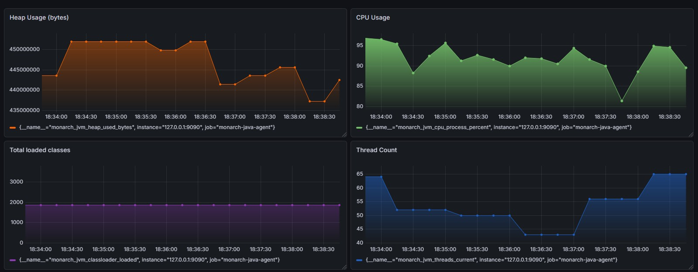

# MonarchJavaAgent

MonarchJavaAgent is a hybrid Java agent for production diagnostics and JVM observation. It lets you attach targeted bytecode instrumentation to a live JVM, expose Prometheus-compatible JVM metrics, and use runtime configuration to move between instrumenter, observer, and hybrid workflows without changing the application code.

This is useful when you need to:

- inspect a hot method in production without redeploying
- inject a temporary diagnostic probe to validate a runtime hypothesis
- expose JVM health signals to Prometheus and Grafana
- combine runtime traces with monitoring data during incident response

## Features

- **Stack Trace Printing**: Print the stack trace when a certain method is invoked. Supports conditional printing only if a specific class/method appears in the current stack trace.
- **Return Value Logging**: Log the return value of a method.
- **Custom code addition**: Add custom code to a method.
- **Heap Dump Capture**: Take a heap dump when a method is invoked or exits.
- **Method Execution Time**: Print the time taken for a method's execution (Bit buggy currently and needs bytecode verification to be turned off).
- **System Flags Printing**: Print system flags of the target application.
- **JVM Options Printing**: Print JVM options of the target application.
- **JVM Heap Usage Details**: Print JVM heap usage details of the target application.
- **JVM CPU Usage Details**: Print JVM CPU usage details of the target application.
- **JVM GC Stats**: Print JVM Garbage Collection stats including collection count and time.
- **JVM Thread Stats**: Print JVM thread stats including current thread count and peak thread count.
- **JVM Classloader Stats**: Print JVM class loading stats including loaded/unloaded classes, class load rate, and Metaspace usage.
- **Metrics HTTP Endpoint**: Exposes JVM metrics (heap, GC, threads, CPU, classloader) via a built-in `/metrics` endpoint in Prometheus text format, with OpenMetrics negotiation support and JSON compatibility at `/metrics.json`.
- **Alert Emails**: Sends alert emails for high heap usage, high CPU usage, thread deadlock, high classloading, etc. in the target application. 

## Production Use Cases

- Attach to a live JVM and trace method arguments, return values, or stack frames on a hot path.
- Add a temporary runtime debug probe with `ADD` or `CODEPOINT` rules to confirm an application hypothesis.
- Run in `observer` mode to expose JVM metrics to Prometheus without enabling bytecode instrumentation.
- Run in `hybrid` mode to combine targeted instrumentation and scrapeable metrics during incident investigation.

## Architecture (Current)

After refactoring, startup wiring is split into focused bootstrap components:

- `AgentConfigurator`: thin facade used by `Agent.premain` and `Agent.agentmain`.
- `AgentStartupOrchestrator`: startup sequence orchestration.
- `LoggingBootstrap`, `ConfigBootstrap`, `TraceBootstrap`, `SmtpBootstrap`, `TransformerBootstrap`, `InstrumentationManagerBootstrap`: focused startup stages.

This keeps behavior unchanged while reducing coupling in the startup path.

Transformer internals are also split using a handler strategy:

- `GlobalTransformer`: orchestration (rule selection, backup, dispatch)
- `ActionExecution`: per-rule execution context
- `transformer.handlers.*`: isolated action handlers (`ARGS`, `RET`, `STACK`, `HEAP`, `ADD`, `PROFILE`)

## Agent Arguments

| Argument          | Description                                                               |
|-------------------|---------------------------------------------------------------------------|
| `configFile`      | Path to the configuration file specifying agent behavior **[Mandatory]**. |
| `agentLogFileDir` | Directory where initialization logs will be written.                      |
| `agentLogLevel`   | Log verbosity level (`DEBUG`, `INFO`, `WARN`, `ERROR`).                   |
| `smtpProperties`  | Path to SMTP configuration for sending alert emails.                      |
| `agentJarPath`    | Path to the MonarchJavaAgent jar **[Mandatory for startup attach]**.      |


## Usage

You can attach MonarchJavaAgent either during startup or during runtime.

**For startup:**

1. Download the latest agent JAR file from releases page.
2. Start your Java application using the `-javaagent` option.
3. Specify the configuration file and other options as needed.

Example command to attach the agent:

```bash 
java -Xverify:none -javaagent:/path/to/MonarchJavaAgent.jar=configFile=/path/to/config.yaml,agentLogFileDir=/path/to/log/dir,agentLogLevel=DEBUG,smtpProperties=/path/to/smtpProperties.props,agentJarPath=/path/to/MonarchJavaAgent.jar YourMainClass
```

**For Runtime:**

1. Download the latest agent JAR file from releases page.
2. Start your application.
3. Run "monarchAgentStart.bat"/"monarchAgentStart.sh" and provide the requested details.

Example command run:
```bash 
C:\Users\ashut\monarch-java-agent\attachScript> .\monarchAgentStart.bat
Enter path to the agent JAR file: C:\Users\ashut\monarch-java-agent\target\monarch-java-agent-1.1-SNAPSHOT.jar
Enter path to the agent config file: C:\Users\ashut\monarch-java-agent\sampleConfig\mConfig.yaml
Enter arguments to pass to the agent: agentLogFileDir=C:\Users\ashut\manualTesting,agentLogLevel=DEBUG,smtpProperties=/path/to/smtpProperties.props
Enter PID of the target JVM (press Enter to use current JVM): 24300
Agent attached successfully to PID 24300
```

## Configuration

MonarchJavaAgent now supports a nested, mode-aware YAML structure. Supported modes are:

- `instrumenter`: enable bytecode instrumentation only
- `observer`: enable JVM observation/metrics only
- `hybrid`: enable both instrumentation and observer features

Canonical sample configuration:

```yaml
mode: hybrid

instrumentation:
  enabled: true
  configRefreshInterval: 15
  traceFileLocation: C:\\TraceFileDumps
  agentRules:
    - ClassA::methodA@INGRESS::STACK
    - ClassA::methodA@INGRESS::ARGS
    - ClassA::methodA@EGRESS::RET
    - ClassA::methodB@INGRESS::ARGS
    - ClassA::methodB@INGRESS::STACK::[com.asm]
    - ClassA::methodB@EGRESS::STACK
    - ClassA::methodB@EGRESS::RET
    - ClassB::methodC@PROFILE
    - ClassB::methodC@INGRESS::HEAP
    - ClassB::methodC@INGRESS::ADD::[System.out.println(20);]
    - ClassA::methodA@INGRESS::ADD::[System.out.println(this.getClass().getName());]
    - ClassA::methodA@CODEPOINT(11)::ADD::[System.out.println(499);]
    - ClassA::methodA@CODEPOINT(11)::ADD::[System.out.println(499 + "," + "Ashutosh Mishra");]

observer:
  enabled: true
  printClassLoaderTrace: true
  printJVMSystemProperties: true
  printEnvironmentVariables: true
  metrics:
    exposeHttp: true
    port: 9090
    heapUsage: true
    cpuUsage: true
    threadUsage: true
    gcStats: true
    classLoaderStats: true

alerts:
  enabled: true
  maxHeapDumps: 3
  emailRecipientList:
    - abc@example.com
    - ashutosh@asm.com
```

Backward compatibility:

- Legacy flat keys such as `shouldInstrument`, `printJVMHeapUsage`, `exposeMetrics`, and `metricsPort` are still supported.
- Legacy flat keys are deprecated and now emit warnings during config parsing.
- If both nested and legacy forms are present for the same setting, the nested value wins.

Current implementation note:

- `instrumentation.traceFileLocation` is still used as the shared trace output root for both instrumentation and observer trace output.
- For `observer` mode, set `instrumentation.traceFileLocation` as well until trace output is moved to a common/shared config section in a future cleanup.

Launch args remain separate from YAML:

- `configFile`
- `agentLogFileDir`
- `agentLogLevel`
- `smtpProperties`
- `agentJarPath`

See the checked-in example at [sampleConfig/mConfig.yaml](C:\Users\ashut\Documents\Personal Projects\MonarchJavaAgent\sampleConfig\mConfig.yaml).

Legacy flat example still accepted:

```yaml
shouldInstrument: true
configRefreshInterval: 15
traceFileLocation: C:\\TraceFileDumps
agentRules:
  - ClassA::methodA@INGRESS::STACK
printJVMHeapUsage: true
printJVMCpuUsage: true
printJVMThreadUsage: true
printJVMGCStats: true
printJVMClassLoaderStats: true
exposeMetrics: true
metricsPort: 9090
maxHeapDumps: 3
sendAlertEmails: true
emailRecipientList:
  - abc@example.com
```

## Rule Syntax

The rule syntax for MonarchJavaAgent follows the format:

```plaintext
<FQCN>::<MethodName>@<EVENT>::<ACTION>
```

Where:

- `<FQCN>`: Fully Qualified Class Name.
- `<MethodName>`: Name of the method.
- `<EVENT>`: Event at which the action should be performed. Possible values are:
    - INGRESS
    - EGRESS
    - CODEPOINT
    - PROFILE (Note: PROFILE is a special case and no ACTION is required along with it.)
- `<ACTION>`: Action to be performed. Possible values are:
    - STACK: Print stack trace.
    - HEAP: Capture heap dump.
    - ARGS: Log method arguments.
    - RET: Log method return value.
    - ADD: Add custom code.

## Metrics Endpoint

If `observer.metrics.exposeHttp: true` is enabled in the config, MonarchJavaAgent starts a lightweight HTTP server exposing JVM metrics.

Default endpoints:

- `http://localhost:9090/metrics` (Prometheus text format by default)
- `http://localhost:9090/metrics.json` (legacy JSON compatibility)

`/metrics` supports OpenMetrics content negotiation. If the request includes:

- `Accept: application/openmetrics-text; version=1.0.0`

the endpoint responds with OpenMetrics content type and EOF marker.

Exported metrics include:

- Heap usage (bytes and usage percentages)
- CPU load and cores
- GC interval stats (per-GC labels)
- Thread stats
- Classloader stats
- Agent info + scrape timestamp

## Prometheus And Grafana

MonarchJavaAgent fits cleanly into a standard Prometheus and Grafana stack. Prometheus scrapes Monarch's `/metrics` endpoint, and Grafana visualizes the exported JVM signals without requiring a separate exporter.

Minimal Prometheus scrape config:

```yaml
global:
  scrape_interval: 5s

scrape_configs:
  - job_name: "monarch-java-agent"
    static_configs:
      - targets: ["127.0.0.1:9090"]
```

Common Prometheus queries:

- `monarch_jvm_heap_used_bytes`
- `monarch_jvm_cpu_process_percent`
- `monarch_jvm_threads_current`
- `monarch_jvm_classloader_loaded`

Example Grafana dashboard using Monarch metrics:



## Building from Source

```bash
git clone https://github.com/AshutoshIWNL/MonarchJavaAgent.git
cd MonarchJavaAgent
mvn clean package
```

## Smoke Testing (Startup + Runtime Attach)

The project now includes an integration smoke harness that validates:

- `-javaagent` startup mode
- Runtime attach mode via Attach API
- Instrumentation markers for `ARGS`, `RET`, `STACK`, `PROFILE`, `ADD`, `CODEPOINT`, `HEAP`
- Metrics endpoint availability
- Heap dump generation
- Runtime config reload behavior (rule removal stops instrumentation effect without restart)
- Invalid rule behavior (startup failure for malformed action rules)
- Nested-vs-legacy config precedence behavior at runtime

### Prerequisites

- Java + Maven available in `PATH`
- For runtime attach tests, set `JAVA_HOME` to a JDK (not JRE)
- Profiling/instrumentation currently runs with bytecode verification disabled (`-Xverify:none`) in smoke scripts

### Windows (PowerShell)

```powershell
powershell -ExecutionPolicy Bypass -File scripts\smoke-all.ps1
```

To run individual suites:

```powershell
# full startup + attach coverage
powershell -ExecutionPolicy Bypass -File scripts\smoke-javaagent.ps1
powershell -ExecutionPolicy Bypass -File scripts\smoke-attach.ps1

# quick partial checks (fast signal)
powershell -ExecutionPolicy Bypass -File scripts\smoke-quick.ps1

# deep runtime config reload checks
powershell -ExecutionPolicy Bypass -File scripts\smoke-config-reload.ps1

# invalid rule behavior check
powershell -ExecutionPolicy Bypass -File scripts\smoke-invalid-rule.ps1

# nested config overrides legacy flat keys
powershell -ExecutionPolicy Bypass -File scripts\smoke-config-precedence.ps1
```

### Linux/macOS (Shell)

```bash
chmod +x scripts/*.sh
export JAVA_HOME=/path/to/jdk
bash scripts/smoke-all.sh
```

To run individual modes:

```bash
# full startup + attach coverage
bash scripts/smoke-javaagent.sh
bash scripts/smoke-attach.sh

# quick partial checks (fast signal)
bash scripts/smoke-quick.sh

# deep runtime config reload checks
bash scripts/smoke-config-reload.sh

# invalid rule behavior check
bash scripts/smoke-invalid-rule.sh

# nested config overrides legacy flat keys
bash scripts/smoke-config-precedence.sh
```

Smoke run artifacts (trace/log/config) are written to temp run directories under:

- Windows: `%TEMP%\mja-smoke\...`
- Linux/macOS: `/tmp/mja-smoke/...`

## Author

- **Ashutosh Mishra** (https://github.com/AshutoshIWNL)

## License

This project is licensed under the Apache License 2.0 - see the [LICENSE](LICENSE) file for details.
